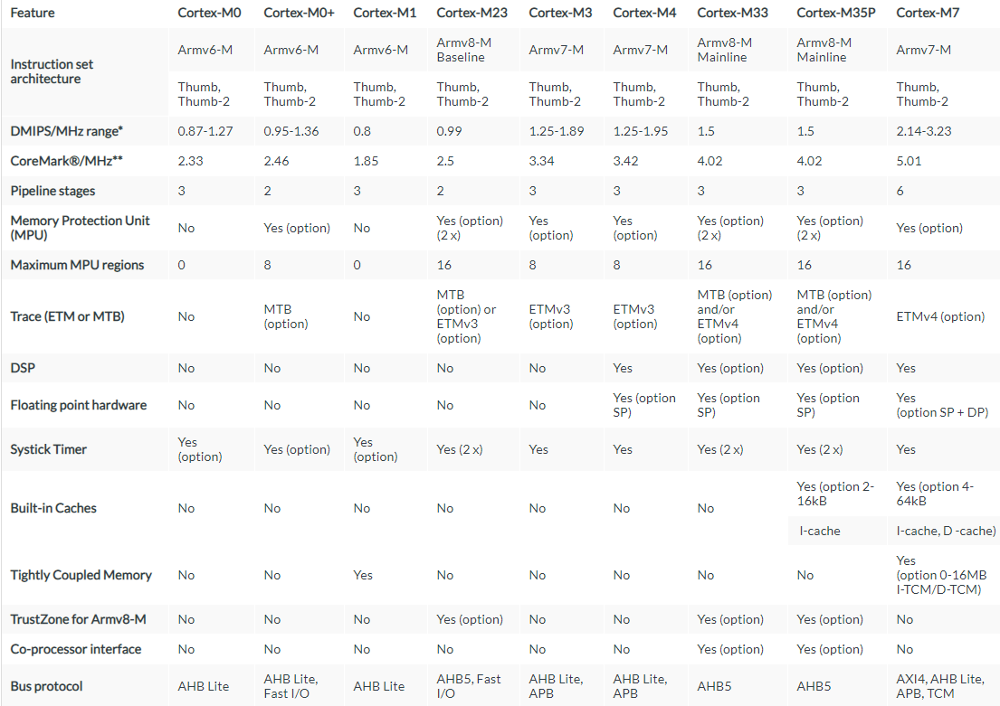
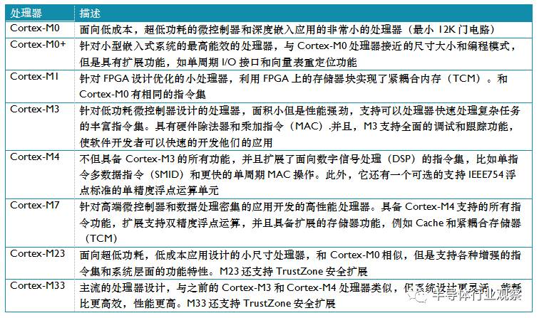

# [Cortex M](https://github.com/sochub/CM) 

 

#### 归属：[Cortex](https://github.com/sochub/Cortex)

## [架构简介](https://github.com/sochub/CM/wiki)

 [Cortex M](https://github.com/sochub/CM) 是一个家族系列，主要应用于控制器芯片，其中包括多个不同型号，每个型号之间会有些区别，但编程模型基本是一致的。

 

 

### 特性

- 所有的Crotex-M处理器都支持R0到R15，PSR, CONTROL 和 PRIMASK

- 两个特殊的寄存器— FAULTMASK 和 BASEPRI—只有Cortex-M3, Cortex-M4, Cortex-M7 和 Cortex-M33支持

- 浮点寄存器组和FPSCR（浮点状态和控制寄存器）寄存器，是Cortex-M4/M7/M33可选的浮点运算单元使用的

- 所有的Cortex-M 处理器都支持Thumb指令集，已扩展到同时支持16位和32位指令Thumb-2版本

- 内置的嵌套向量中断控制负责中断处理，自动处理中断优先级，中断屏蔽，中断嵌套和系统异常处理

- 中断处理函数可以使用标准的C语言编程，嵌套中断处理机制避免了使用软件判断哪一个中断需要响应处理。同时，中断响应速度是确定性的，低延迟的

- 向量表从跳转指令变为中断和系统异常处理函数的起始地址

### 低功耗

- WFI和WFE指令

- 架构级的休眠模式定义

- 休眠和深度休眠模式：架构级支持的特性，通过设备特定的功耗管理寄存器可以进一步扩展。

- Sleep-on-exit模式：中断驱动的应用的低功耗技术。开启设置后，当异常处理程序结束并且没有其他等待处理的异常中断时，处理器自动进入到休眠模式。

- 唤醒中断控制器（WIC）:一个可选的特性，在特定的低功耗状态，由一个独立于处理器的小模块侦测中断情况。例如，在状态保留功耗管理（SRPG）设计中，当处理器被关电的设计。

- 时钟关闭和架构级时钟关闭：通过关闭处理器的寄存器或者子模块的时钟输入来省电

Cortex-M引入了操作模式和特权级别的概念，分别为线程模式和处理模式，如果进入异常或中断处理则进入处理模式，其他情况则为线程模式。

### [相关型号](https://github.com/sochub)

* [Cortex M0](https://github.com/sochub/CM0)
* [Cortex M3](https://github.com/sochub/CM3)
* [Cortex M4](https://github.com/sochub/CM4)
* [Cortex M7](https://github.com/sochub/CM7)

### [选型建议](https://github.com/sochub)

当前MCU领域的主要内核是 [Cortex M](https://github.com/sochub/CM) 架构，但更可期的是 [RISC-V](https://github.com/sochub/RISC-V) 架构，更高性能的和计算密度的是[MIPS](https://github.com/sochub/MIPS)

由于MIPS内核中有32个寄存器（Register），而ARM只有16个，这种结构设计上的先天优势，决定了在同等性能表现下，MIPS的芯片面积和功耗会更小。

##  [SoC资源平台](http://stop.stops.top) 

