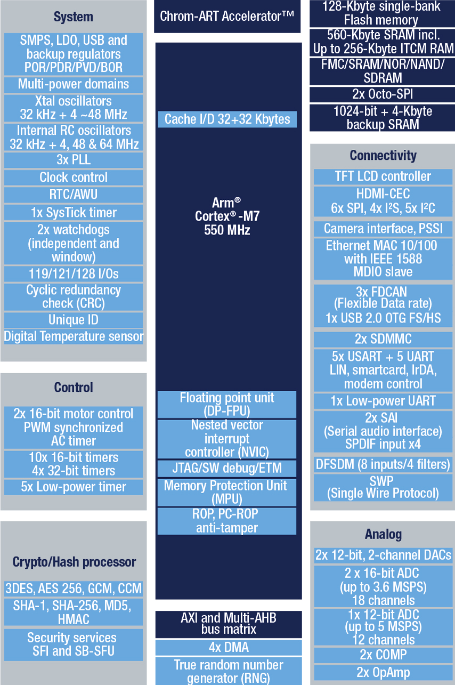

# [STM32H730](https://github.com/SoCXin/STM32H730)

* [ST](https://www.st.com/zh/): [Cortex-M7](https://github.com/SoCXin/Cortex)
* [L6R5](https://github.com/SoCXin/Level): 550 MHz (2778 CoreMark,1177 DMIPS)

## [简介](https://github.com/SoCXin/STM32H730/wiki)

### 关键特性

* Cortex-M7 550 MHz 封顶
* 564KB RAM,128KB flash
* OctoSPI
* Ethernet
* USB OTG HS

#### 相对短板

* 片上集成flash几乎无法支撑开发
* 片上RAM资源相对同系较小

### [资源收录](https://github.com/SoCXin)

* [参考资源](src/)
* [参考文档](docs/)
* [参考工程](project/)
* [入门教程](https://docs.soc.xin/STM32H730)

### [选型建议](https://github.com/SoCXin)

[STM32H730](https://github.com/SoCXin/STM32H730) 性价比是非常高，在拥有几个大件外设情况下，除了小封装外，几乎没给STM32F4留多少机会。

#### 封装规格

IO数量80-120，官方价: $2.83-3.67

* STM32H730IBH($3.67): UFBGA176 (10×10mm)
* STM32H730ABH($3.37): UFBGA169 (7x7mm)
* STM32H730ZBH($3.24): UFBGA144 (7x7mm)
* STM32H730VBH($2.83): TFBGA100 (8x8mm)
* STM32H730IBT($3.67): LQFP176 (24×24mm)
* STM32H730ZBT($3.24): LQFP144 (20×20mm)
* STM32H730VBT($2.83): LQFP100 (14×14mm)

### [探索芯世界 www.SoC.xin](http://www.SoC.Xin)
